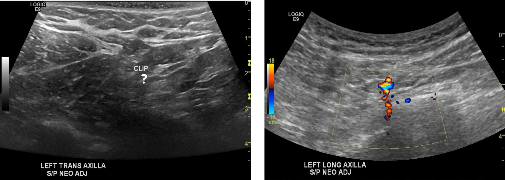
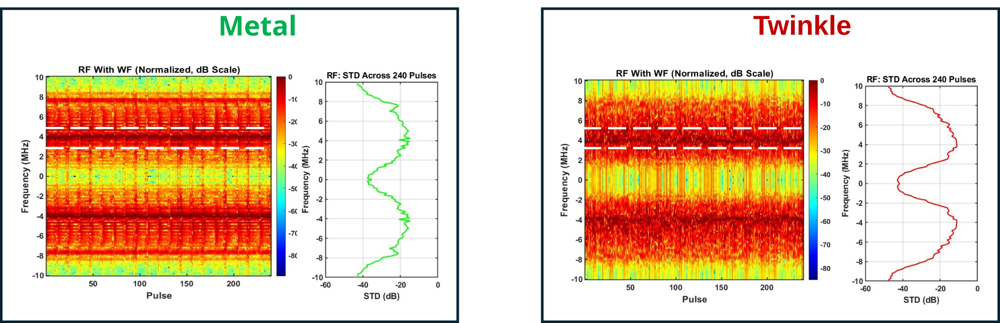
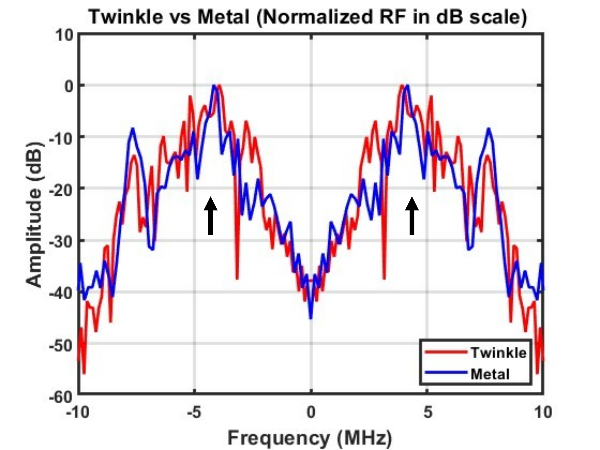

# Frequency-Domain Analysis of Doppler Twinkling Signals

## Overview
This project investigates the frequency-domain and temporal
characteristics of color Doppler twinkling in polymethyl methacrylate
(PMMA) markers. Twinkling PMMA signals were compared with non-twinkling
metal signals in the beamformed RF and IQ domains.

## Motivation
Color Doppler twinkling can improve ultrasound visualization of highly
reflective targets, including biopsy markers. However, the signal
characteristics responsible for the artifact remain incompletely
understood.

This project examines the signal before formation of the final Doppler
image. The goal is to identify temporal and spectral characteristics
that distinguish twinkling from a stable reflector.

Figure: Demonstration of Twinkling Marker within human patient

## Methods
-   Verasonics V1 ultrasound system
-   PMMA twinkling marker and non-twinkling metal target
-   Plane-wave Doppler transmission
-   4 MHz Doppler transmit frequency
-   2.5 kHz pulse repetition frequency
-   Delay-and-sum beamforming using MUST
-   IQ demodulation
-   Wall filtering
-   RF and IQ frequency-spectrum analysis
-   Pulse-wise and frame-wise variability analysis

Raw channel RF data were processed through beamforming, IQ demodulation,
wall filtering, and Doppler estimation.

## Temporal Signal Analysis
The PMMA marker showed greater temporal signal variation than metal.
Metal maintained a relatively stable response, whereas the twinkling
PMMA signal showed larger changes across repeated pulses and frames.

## RF Frequency-Domain Analysis

 
The beamformed RF spectrum showed clear differences between PMMA and
metal. After wall filtering, metal maintained a relatively smooth and
stable spectral response. PMMA retained greater residual energy and
showed broader and more irregular spectral content.

Normalization reduced differences caused by overall signal magnitude and
emphasized differences in spectral distribution.

## IQ Frequency-Domain Analysis
IQ demodulation shifted the RF spectral content toward baseband. The
difference between PMMA and metal remained visible after demodulation.
PMMA showed greater spectral variation, whereas metal maintained a more
stable spectral response.

## Key Findings
-   PMMA showed greater temporal variability than non-twinkling metal.
-   Wall filtering suppressed stationary signal components and revealed
    differences associated with the twinkling response.
-   Beamformed RF spectra from PMMA showed broader and more irregular
    spectral content than metal.
-   Spectral differences remained after normalization.
-   IQ analysis preserved the stability-versus-variability contrast
    observed in the RF domain.
-   Pulse-to-pulse variation and spectral variability provided
    complementary measures of the twinkling response.

## Significance
The results show that Doppler twinkling has measurable temporal and
spectral characteristics before formation of the final color Doppler
image.

Frequency-domain analysis provides a direct way to characterize these
differences in RF and IQ signals. These signal-level features may
support quantitative twinkling detection and the development of
ultrasound-visible markers.

## Related Presentation
- **Masud, A. A.,** Wood, B.G., Lee, C.U. & Urban, M.W.,. (2025) Signal Processing Analysis of Twinkling Artifact in Ultrasound Doppler Imaging. 188th Acoustical Society of America meeting, New Orleans, USA
- **Masud, A. A.,** Wood, B.G., Lee, C.U. & Urban, M.W., Radiofrequency and IQ Signal Analysis of Pressure-Dependent Twinkling Artifacts in PMMA Breast Biopsy Markers. 2025 IEEE International Ultrasonics Symposium (IUS), Utrecht, Netherlands, 2025 (Poster).

## Resources
-   Analysis Code
-   Presentation

