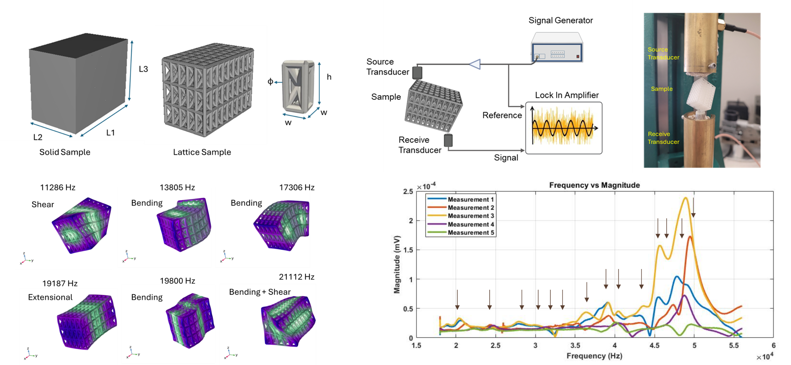

# Resonant Ultrasound Spectroscopy for Characterizing 3D-Printed Lattice Materials

## Overview

This project investigated the use of Resonant Ultrasound Spectroscopy (RUS) to estimate the effective elastic properties of architected 3D-printed polymer lattice structures. The work combined experimental resonance measurements, finite element analysis (FEA), and optimization techniques to characterize anisotropic mechanical behavior in lightweight cellular materials.

## Motivation

Traditional mechanical testing methods often require destructive loading and may not fully capture the intrinsic stiffness of complex lattice structures. Resonant Ultrasound Spectroscopy offers a non-destructive alternative by analyzing the natural vibration frequencies of a specimen and relating them to its elastic properties.

## Methods

- Designed and fabricated anisotropic 3D-printed lattice structures.
- Measured resonance frequencies using an experimental RUS setup.
- Developed finite element models to predict eigenfrequencies.
- Applied Particle Swarm Optimization (PSO) to estimate stiffness tensor components.
- Compared resonance-derived elastic properties with conventional quasi-static mechanical testing.

## Figure

*Combined illustration showing the lattice geometry, experimental RUS setup, finite element model, and representative resonance spectra.*

## Key Findings

- Successfully estimated anisotropic elastic constants of polymer lattice structures.
- Demonstrated strong agreement between experimentally measured and simulated resonance modes.
- Resonance-based measurements produced higher effective moduli than quasi-static compression tests, highlighting the influence of local deformation mechanisms in traditional testing.
- Established a framework for non-destructive characterization of architected materials and metamaterials.

## Significance

This work demonstrates how acoustic resonance methods can provide rapid, non-destructive evaluation of mechanical properties in additively manufactured structures. The approach can be extended to quality assurance, material characterization, and the development of next-generation biomedical and engineering lattice materials.

## Publications

**Al Masud A, Egan PF, Liu J, Fisher KA.**  A stochastic approach for calculating elastic constants of polymer lattice structures based on spectral ultrasonic data. Ultrasonics, 107870.

## Collaboration

* Lawrence Livermore National laboratory

## Resources

- 💻 GitHub Repository (coming soon)
- 📊 Conference Presentation (coming soon)
