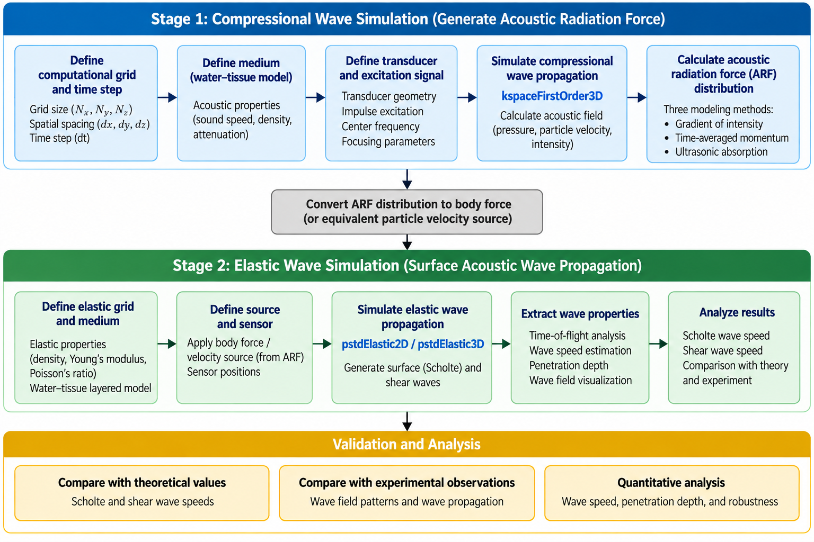

# Numerical Simulation of Surface Acoustic Waves for Elastography Using k-Wave

## Overview

This project developed a **numerical simulation framework for impulse-induced surface acoustic waves** using the MATLAB-based k-Wave toolbox for quantitative elastography.

The work modeled the complete process from **ultrasound excitation and acoustic radiation force (ARF) generation to Scholte-wave propagation at a water–tissue interface**, providing a computational platform for investigating superficial tissue mechanics.

## Methods

- Developed a **two-stage k-Wave simulation framework** combining compressional and elastic wave simulations.
- Modeled ultrasound propagation and calculated **acoustic radiation force (ARF)** using three force formulations.
- Converted ARF into an equivalent particle-velocity source for elastic-wave simulation.
- Simulated **Scholte and shear-wave generation and propagation** at a water–tissue interface.
- Estimated wave speeds using **time-of-flight analysis** and compared results with theoretical and experimental observations.

### Simulation Workflow

*Two-stage numerical framework for simulating ARF-induced surface acoustic waves using k-Wave.*

## Key Findings

- Successfully simulated **Scholte waves and shear waves** generated by ARF excitation.
- Three ARF models produced similar spatial force distributions but substantially different force amplitudes.
- Scholte and shear waves propagated at different depths and progressively separated during propagation.
- Simulated Scholte-wave speed was approximately **8.5 m/s**, while shear-wave speed was approximately **10.1 m/s**.
- The simulated Scholte-to-shear wave speed ratio (**~0.84**) closely matched the theoretical value (**0.839**).
- Numerical wave behavior showed qualitative agreement with experimental observations.

## Figures

### Surface and Shear Wave Propagation

*Simulated Scholte wave propagating near the water–tissue interface and shear wave propagating deeper within the tissue.*

### Acoustic Radiation Force

*Comparison of acoustic radiation force distributions obtained using different ARF modeling approaches.*

### Simulation Validation

*Comparison of simulated wave behavior with theoretical expectations and experimental observations.*

## Technical Skills

**MATLAB • k-Wave • Numerical Modeling • Acoustic Simulation • Elastic Wave Modeling • Ultrasound Physics • Signal Processing • Time-of-Flight Analysis • Quantitative Elastography**

## Publication

**Masud AA, Liu J.** *Numerical simulation of impulse-induced surface acoustic waves for elastography purposes using k-Wave simulation toolbox.* **Journal of Applied Physics, 136, 164701 (2024).**  
DOI: **10.1063/5.0228454**

## Resources

- 📄 Published Article
- 💻 GitHub Repository: Coming Soon
- 🧮 Simulation Code: Coming Soon
