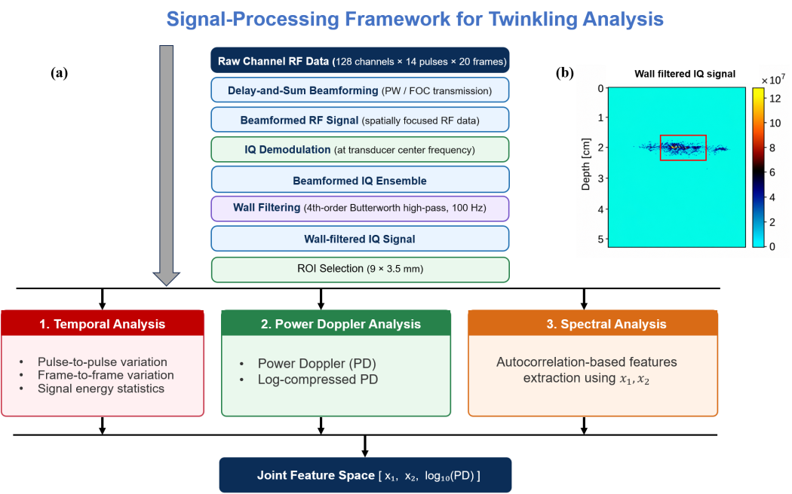
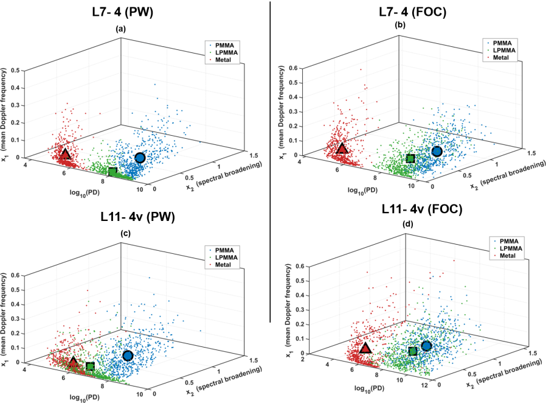

# Quantitative Signal-Processing Analysis of Color Doppler Twinkling

## Overview

This project investigates how color Doppler twinkling is represented across the ultrasound signal-processing chain. Controlled PMMA, low-twinkling PMMA (LPMMA), and metal targets were used to examine strong, reduced, and minimal twinkling responses.

The analysis follows the signal from beamformed RF data through IQ demodulation, wall filtering, Power Doppler estimation, and autocorrelation-based spectral feature extraction.

## Motivation

Color Doppler twinkling can improve the detection of highly reflective targets such as biopsy markers and calcifications, but the signal characteristics that produce the displayed artifact remain incompletely understood.

Most previous studies have evaluated twinkling from the final Doppler image. This project examines the signal at intermediate processing stages to determine where material-dependent differences emerge and how acquisition settings affect those differences.

## Methods

Ultrasound data were acquired using a Verasonics V1 system with L7-4 and L11-4v linear-array transducers.

Acquisition conditions included:

- PMMA, LPMMA, and metal targets
- Plane-wave (PW) and focused (FOC) transmission
- Doppler transmit frequencies of 4, 5, and 6 MHz
- 14 pulses per Doppler ensemble
- 2.5 kHz pulse repetition frequency
- 20 consecutive Doppler frames
- Five samples per acquisition condition

 

### Signal-Processing Pipeline

1. Raw channel RF acquisition
2. Delay-and-sum beamforming
3. IQ demodulation
4. Wall filtering
5. ROI-based temporal analysis
6. Power Doppler estimation
7. Autocorrelation-based spectral feature extraction

Two autocorrelation-derived features were evaluated:
- `x1`: mean Doppler frequency
- `x2`: spectral broadening
 

Power Doppler was represented as `log10(PD)`.
The three measures were combined into the joint feature space:
[x1, x2, log10(PD)]
Pairwise material overlap was quantified using the three-dimensional Bhattacharyya coefficient (BC3D), where lower BC3D indicates greater material separation.
Pulse-wise and frame-wise analyses were also used to examine the temporal behavior of the beamformed RF signal.

## Key Findings

- Material-dependent signal differences became clear after wall filtering and remained evident through IQ and Power Doppler processing.

- PMMA generally produced the strongest residual Doppler response, LPMMA showed an intermediate response, and metal produced the lowest response.

- Pulse-wise and frame-wise RF analyses showed different temporal behavior. The pulse-wise signal showed a structured response within the Doppler ensemble, whereas temporal correlation was weaker across consecutive frames.

- PMMA was characterized by low `x1`, greater spectral broadening (`x2`), and high `log10(PD)`. Metal showed substantially lower spectral broadening and Doppler energy, while LPMMA occupied an intermediate region.

- Combining `x1`, `x2`, and `log10(PD)` provided complementary spectral and energy information and improved material separation compared with the spectral features alone.

- Transmission mode primarily affected Doppler energy, while `x1` and `x2` showed smaller changes between PW and FOC transmission.

- Material separability depended strongly on transmit frequency and transducer. For L7-4 PW transmission, LPMMA–metal BC3D increased from 0.009 ± 0.012 at 4 MHz to 0.941 ± 0.005 at 5 MHz and 0.980 ± 0.002 at 6 MHz.

- L11-4v showed a different frequency dependence and maintained stronger separation for several material comparisons at 5 and 6 MHz.

## Publications
- **Masud, A. A., Wood, B.G., Lee, C.U. & Urban, M.W., Signal Characteristics of Color Doppler Twinkling Across the Ultrasound Processing Chain (Submitted to Ultrasonics)
**
Related work:
- Masud, A. A., Wood, B.G., Lee, C.U. & Urban, M.W.,. (2025) Signal Processing Analysis of Twinkling Artifact in Ultrasound Doppler Imaging. 188th Acoustical Society of America meeting, New Orleans, USA (Conference Talk)
- Al Masud A, Wood B, Lee CU, Urban MW. Quantifying Doppler Twinkling in Polymethyl Methacrylate Markers Using Channel-Level Signal Features. IEEE International Ultrasonics Symposium (IUS) 2026, Raleigh, NC, USA (Poster).
- Masud, A. A., Wood, B.G., Lee, C.U. & Urban, M.W., Radiofrequency and IQ Signal Analysis of Pressure-Dependent Twinkling Artifacts in PMMA Breast Biopsy Markers. 2025 IEEE International Ultrasonics Symposium (IUS), Utrecht, Netherlands, 2025 (Poster).

## Resources
- Github Repository
- Presentation Slides
