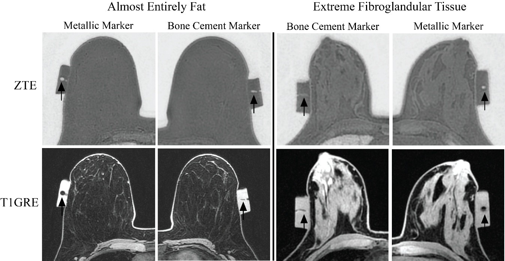
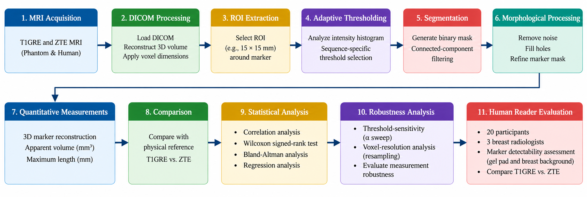
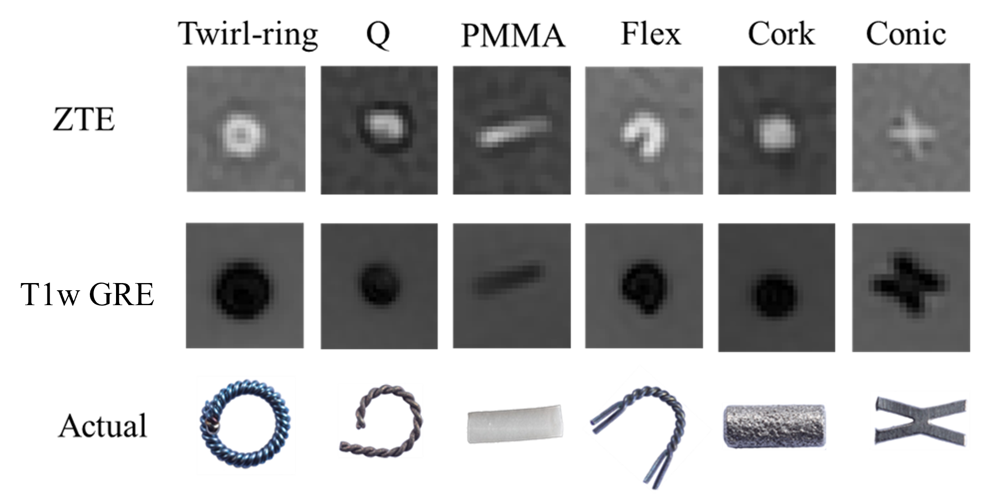
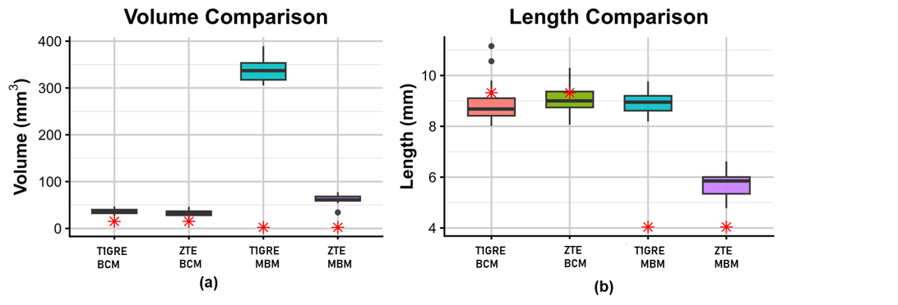

# Quantitative Analysis of Breast Biopsy Markers Using ZTE MRI

## Overview

This project investigated **Zero Echo Time (ZTE) MRI** for improving visualization and quantitative characterization of breast biopsy markers compared with conventional T1-weighted GRE (T1GRE) MRI. The work combined **phantom imaging, human imaging studies, DICOM image processing, 3D segmentation, statistical analysis, and algorithm sensitivity testing** to evaluate marker artifact size, geometric accuracy, and detectability.

## Methods

- Analyzed **38 biopsy markers** using ZTE and T1GRE MRI in controlled phantoms.
- Developed MATLAB pipelines for **DICOM processing, ROI extraction, adaptive thresholding, segmentation, volume estimation, and maximum-length measurement**.
- Extended the analysis to a **20-participant human imaging study** with reader-based marker detectability assessment.
- Performed **threshold-sensitivity and voxel-resolution analyses** to evaluate measurement robustness.

### Analysis Workflow

*Workflow for quantitative ZTE/T1GRE MRI analysis, from image acquisition and DICOM processing through segmentation, quantitative measurement, statistical analysis, and human-reader evaluation.*

## Key Findings

- ZTE substantially reduced blooming from metallic markers compared with T1GRE.
- Metallic-marker apparent volume decreased from **324.17 mm³ on T1GRE to 85.30 mm³ on ZTE — a 73.7% reduction**.
- ZTE provided measurements closer to physical marker dimensions in phantom experiments.
- For non-metallic/bone-cement markers, improved visualization was driven more by **marker-to-background contrast** than artifact reduction.
- Threshold-sensitivity and voxel-resolution analyses were used to evaluate measurement robustness.

## Figures

### ZTE vs. T1GRE

*Representative ZTE and T1GRE images demonstrating biopsy-marker visualization in phantom and human breast-tissue backgrounds.*

### Quantitative Results

*Comparison of apparent marker volume and maximum length between T1GRE and ZTE MRI.*

- Metallic-marker apparent volume decreased by **73.7%** on ZTE compared with T1GRE (**324.17 → 85.30 mm³**).
- Metallic-marker maximum length decreased by **23.6%** (**10.12 → 7.73 mm**).
- Bone-cement marker volume showed a smaller **12.5% reduction** (**87.41 → 76.52 mm³**), with minimal change in maximum length.
- ZTE demonstrated **lower measurement bias and improved geometric agreement** with physical marker dimensions compared with T1GRE.
- Quantitative sensitivity analyses evaluated the effects of **segmentation threshold and voxel resolution** on measurement robustness.

## Technical Skills
**MATLAB • Python • R • DICOM • MRI • Medical Image Processing • 3D Segmentation • Adaptive Thresholding • Quantitative Imaging • Statistical Analysis • Algorithm Validation**

## Publication

- **Al Masud A, et al.** *Zero echo time versus T1-weighted gradient-recalled echo MRI of breast biopsy markers: a phantom study comparing susceptibility artifact volume and geometric dimensions.* **Translational Breast Cancer Research, 2026.**
- **Al Masud, A.**, Chartier, S. R., Nwachukwu, C. T., Hesley, G. K., Giri, S., Larson, N. B., Langenfield, I. D., Trzasko, J. D., Urban, M. W., Lee, C. U. Evaluation of a polymethyl methacrylate breast biopsy marker with zero echo time MRI. (Accepted: **European Radiology Experimental**).

## Resources

- 💻 GitHub Repository: Coming Soon

